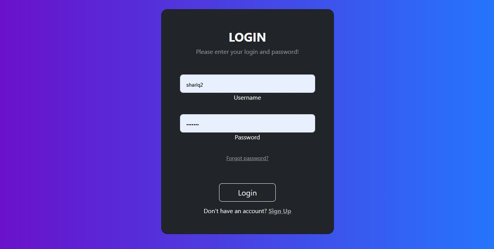
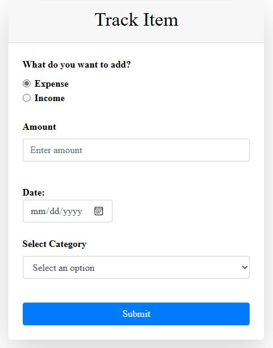
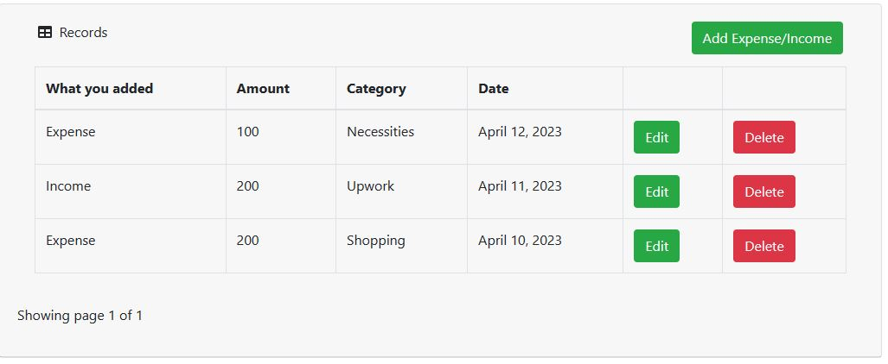
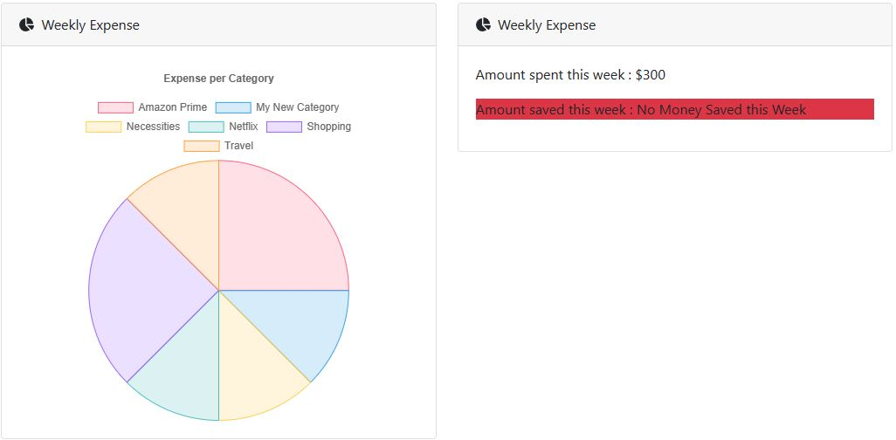
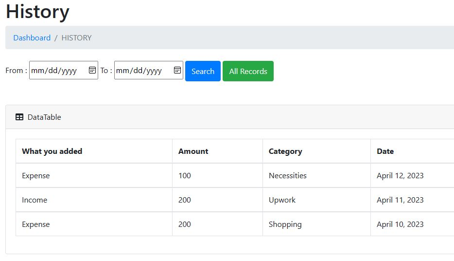

# TrackMyExpenses - A Django Web App for Personal Finance Management

TrackMyExpenses is a simple Django web application for tracking personal expenses and incomes. With this app, you can easily keep track of your finances, add new expenses or incomes, delete them, view visualizations of your spending on a weekly, monthly, and yearly basis, and filter expenses/incomes by date.

## Login Screen



## Installation

- Instructions for installing the project, including any dependencies or prerequisites needed to run it.


1. Clone the repository:

```
git clone https://github.com/yourusername/yourprojectname.git
```

2. Navigate to the project directory: 
```
cd Expense Tracker/
```

3. Create a virtual environment:
```
python3 -m venv env
```

4. Activate the virtual environment:
```
source env/bin/activate
```

5. Install the required dependencies: 
```
pip install -r requirements.txt
```

6. Set up the database: 
```
python manage.py migrate
```

7. Create a superuser:
```
python manage.py createsuperuser
```

8. Run the development server: 
```
python manage.py runserver
```

## Usage

- Instructions for using the project:

1. Login:
The first and obvious step is to login with your credentials, if you do not have an account, click on register and sign up for a new account.


2. Add Expense/Income:
To add an expense or income to your profile, click on the 'Add Expense/Income' button on the Overview page and it will take you to the form that takes in the item details and adds it to your profile


3. Track Expense/Income:
Now, to track your added expense/income, head over to the Overview section from the sidebar and there you will see all of your expenses/incomes as a table


4. Weekly/Monthly/Yearly visualizations:
To checkout your expenses and incomes in a visual format, head over to the VISUALIZATIONS section from the sidebar and click on 'INCOMES RECORD' or 'EXPENSES RECORD', and select weekly, monthly or yearly


5. Expenses/incomes history
To see your expenses on a specific date or within a range of dates, head over to the HISTORY section from sidebar and go to 'Previous Records'


## Features

- Expenses/Incomes tables.
- Add Expenses/incomes
- Delete Expenses/incomes
- Expenses/incomes visualizations on weekly, monthly and yearly basi
- Expenses/incomes history
- Filter Expenses/incomes on date.

## Technologies Used
A list of the main technologies used in the project are:

- HTML
- CSS
- Bootstrap
- JavaScript
- Django
- Sqlite

## Contributing

We welcome contributions from anyone interested in improving Expense Tracker! To contribute, please follow these steps:

1. Fork this repository to your own account.
2. Create a new branch: `git checkout -b my-feature-branch`
3. Make your changes and commit them: `git commit -m "Add some feature"`
4. Push to the branch: `git push origin my-feature-branch`
5. Create a pull request from your branch to this repository.

We will review your pull request and merge it if it meets our quality standards. To ensure a smooth review process, please make sure your code meets the following criteria:

- Your changes are clearly documented and explained.
- Your code adheres to the existing code style and conventions.
- Your code does not break any existing functionality.
- Your code passes any tests or checks required for the project.

Thank you for contributing to Expense Tracker! We appreciate your help in making this project better for everyone.

## Credits

We'd like to thank the following people and resources for their contributions to this project:

- [Aqib Rehman Pir Zada](https://github.com/aqibrehmanpirzada)

## License

This project is licensed under the [MIT License](https://opensource.org/licenses/MIT) - see the [LICENSE](LICENSE) file for details.

You are free to use, modify, and distribute this software for any purpose, commercial or non-commercial, as long as you include the above copyright notice and the following disclaimer:

THIS SOFTWARE IS PROVIDED "AS IS", WITHOUT WARRANTY OF ANY KIND, EXPRESS OR IMPLIED, INCLUDING BUT NOT LIMITED TO THE WARRANTIES OF MERCHANTABILITY, FITNESS FOR A PARTICULAR PURPOSE AND NONINFRINGEMENT. IN NO EVENT SHALL THE AUTHORS OR COPYRIGHT HOLDERS BE LIABLE FOR ANY CLAIM, DAMAGES OR OTHER LIABILITY, WHETHER IN AN ACTION OF CONTRACT, TORT OR OTHERWISE, ARISING FROM, OUT OF OR IN CONNECTION WITH THE SOFTWARE OR THE USE OR OTHER DEALINGS IN THE SOFTWARE.
